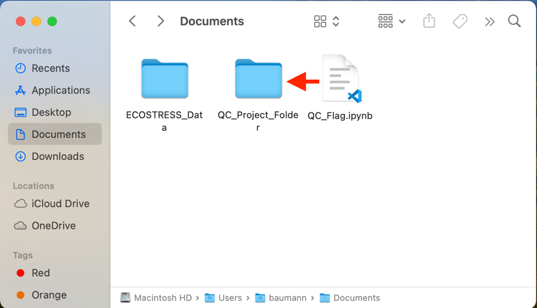
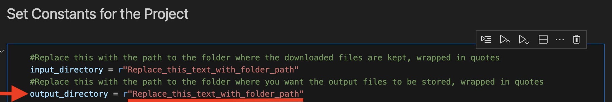
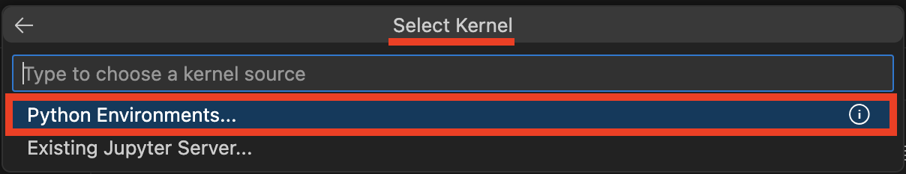

> *This tutorial will show you how to use a code to apply QC flags to
> ECOSTRESS data products. This code shows an example of applying QC
> flags to Land Surface Temperature (LST) products, but it can be
> modified for other ECOSTRESS products.*

# Table of Contents

[What is a QC Flag? [1](#what-is-a-qc-flag)](#what-is-a-qc-flag)

[Applying QC Flags to Images
[2](#applying-qc-flags-to-images)](#applying-qc-flags-to-images)

# What is a QC Flag?

A QC flag is an image used to determine the quality of remotely sensed
imagery. QC stands for quality control. In general, most people want to
use only good pixels, or sometimes only the very best pixels in their
research. ECOSTRESS QC masks have four options:

- 0 = Pixel is perfect

- 1 = Pixel is nominal quality

- 2 = Cloud detected

- 3 = Pixel was not produced

This code will help you remove pixels with 2 or 3 as their QC flags, or
even 1, 2, and 3 if you want only the highest quality data. This will
help improve the accuracy of your data. If you use this code to apply
QC, you will not need to apply a cloud mask to your images because the
cloud cover detection is accounted for in QC flag 2.

**Tip**: Make sure you have **QC** files downloaded in addition to your
ECOSTRESS product files. If you do not know how to download these files,
see the **Downloading from AppEEARS** tutorial. Oftentimes, QC files are
**automatically** included in your requested files because they are
important for good research.

However, to **ensure** they will be present in your requested files on
AppEEARS, you can add them as a requested layer. Whatever product you
are downloading, scroll through the options and look for **QC**, then
press the **plus** to add it to your requested layers.

## Applying QC Flags to Images

1.  Download the **QC_Flag** code from
    <https://github.com/ECOSTRESS-Tutorials/ECOSTRESS-QC-Flag>.

2.  Open your **finder**. Create a **project folder** to store all the
    files for this project by **right clicking** and selecting **New
    Folder**. Name your new folder so that you know it is the main
    project folder.

3.  **Move** the **downloaded code** file into the project folder.

**  
**

4.  **Move** the folder with your **downloaded ECOSTRESS data** into the
    project folder.

5.  **Open the project folder** and create a new **sub folder** to store
    the completed QCed files. To do this, go inside the project folder,
    **right click**, and select **New Folder**. Then name the folder so
    that you know it is for the **outputs**.

6.  Open **Visual Studio Code** and use **File \> Open Folder…** to get
    connected to the main project folder that contains the downloaded
    ECOSTRESS files, the QC_Flags code, and the output subfolder.

|  |  |
|----|----|

7.  In the **EXPLORER** tab, find the **QC_Flags** code and **click** on
    it to open it.

>  style="width:5.15833in;height:3.11264in"
> alt="Graphical user interface, text Description automatically generated" />

**Tip**: If you want to know more about what each line of the code does,
read the **comments** in the code. Comments in the code are identified
by **\#**. These comments do not actually change how the code runs, but
they can be helpful to put notes on how the code works for yourself or
other users. This can also be helpful if you want to customize the code
because it will guide you to which parts you may want to change!

**Examples** of comments (**green text following the \#):**

8.  Then, find the section of the code titled **Set Constants for the
    Project**. Find the variable called **input_directory**. Change the
    text that says **"Replace_this_text_with_folder_path"** to the path
    of the main folder where your ECOSTRESS files are stored.

1.  To **copy the folder path**, use the **EXPLORER** panel on the left
    side of Visual Studio Code to find the folder you are interested in.
    Once you have found it, **right click** on it and select **Copy
    Path**. Now you can paste the path into your code. Make sure it is
    still **wrapped in quotes** and has **r** outside the first quote.

9.  Then, find the variable called **output directory**. Change the text
    that says **"Replace_this_text_with_folder_path"** to the path of
    the folder where you want the output files to be stored. Make sure
    it is still **wrapped in quotes** and has **r** outside the first
    quote.

**Example Directory Set-up:**

10. The last thing you need to set up is how **strict** of a QC you
    would like. Under the section of code titled **Apply the QC Mask to
    the LST** Image, find the part of the code starting with the green
    comment **\# Preprocess the QC File**. By **default**, the code will
    keep values **0 (pixel is perfect)** and **1 (pixel is nominal
    quality)**. However, if you would like to filter for **just 0**
    (perfect pixel values) you can do that by **commenting out** the
    current line of code, and **un-commenting** the QC flag for just 0
    line of the code. To comment or uncomment a line of code, highlight
    the line and press **Command+/**. You will know the line is
    commented when it has a **\#** in front of it and the text turns
    green.

| <u>How your code should look if you want 0 (perfect) and 1 (nominal) pixels:</u> | <u>How your code should look if you want just 0 (perfect) pixels:</u> |
|:--:|:--:|
|  |  |

11. Now the code should be set up to be run with your images. Scroll
    back to the top to the section titled **Import the Libraries we Need
    to Apply the QC Mask**. This is the first block of code we want to
    run. Click into the box with the library importing code and press
    **Shift+Return** to run it.

12. At the top of the window, a pop up will appear prompting you to
    **select a kernel** to run your code with. Click on **Python
    Environments …**

13. Select the **ECOSTRESS** environment that you created, or another
    one if you have a different one you want to use.

**Tip**: If you do not have an ECOSTRESS environment set up, follow the
**Creating an Environment** tutorial to make one.

14. Let the code run for a few seconds. You will see the **seconds
    counting up** in the bottom left of the cell. You will know it is
    done when a **green check mark** appears.

15. Continue this process of running each block of code, in order from
    top to bottom, by clicking into the module with the code and
    pressing **Shift+Return**.

    1.  The **Collect File Names** section of the code will return a
        table with the date and time of the image, LST image file path,
        the associated QC file path, and the output file path that the
        QCed image will be saved to.

**Example:**

2.  The **Apply the QC Mask to the LST Image** section of the code will
    return the name of the QCed file and its missing proportion. If the
    missing proportion is too high, it will give you a message saying
    **“Low quality scene. Skipping this file.”** and that file will not
    be saved to the output folder.

**Example:**

16. Once your code has run, check your **outputs** folder to make sure
    the files have been saved there correctly.

>  style="width:2.19008in;height:3.15064in"
> alt="Text Description automatically generated" />

**Tip**: **\*Read if you do not want to skip files OR you used a polygon
shapefile\***

If you used a **non-rectangular** polygon shapefile instead of a
rectangle selection or shapefile to download ECOSTRESS data, you will
need to **adjust your code** so that it does not skip all of your
images. Part of the code filters for **high quality** images by skipping
files that have more than **50%** of the pixels missing. However, when
your image is clipped to the shapefile you uploaded, it treats the
surrounding area as **missing pixels**. This will cause your code to
flag all of your images as having a high proportion of missing pixels,
and thus they will **not** be saved. Alternatively, you may want to
**keep all your images**, regardless of their missing proportions. To
fix this, look in the **Apply the QC Mask to the LST Image** section,
and find this part of the code:

Highlight that section of the code and press **Command+/** to comment it
out. This means it will be ignored when the rest of the code runs. You
will know you have commented it out when it looks like this:

Then you can proceed with the code as normal!

You have now QCed a batch of ECOSTRESS images!
